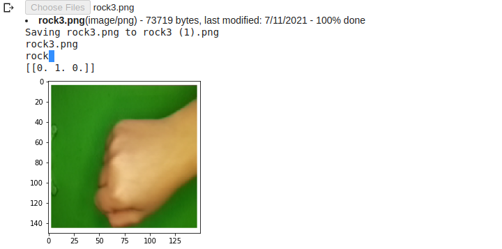

# Multi Class Image Classification

### This is Example that I made about Supervised Learning of Machine Learning Using Neural Network for Image
### Classification with TensorFlow and Keras API

### How to run ?
```
open your notebook (google Collab or Jupyter notebook)
and import the file, and run the script

if there is an error about the tensorflow just change the python to 3.6 version
and open your notebook again
```

### The result


